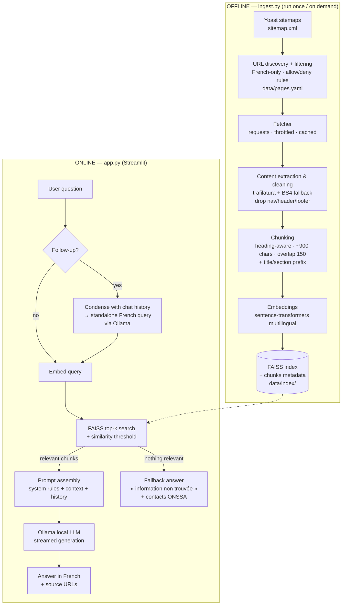

# ONSSA Customer Assistance Chatbot — Project Plan & Architecture

> Internship assignment (Data & AI): RAG chatbot over the official ONSSA website
> (https://www.onssa.gov.ma/) using **Streamlit + Ollama + FAISS**, no paid API.
>
> This document is the blueprint: what we ship, why each technical choice was made,
> and the build order. Written **before** implementation, based on live reconnaissance
> of the ONSSA website (July 2026).

---

## 1. What we ship (deliverables checklist)

| # | Deliverable | Where it lives |
|---|---|---|
| 1 | Streamlit chat application | `app.py` |
| 2 | Ingestion/indexing script (scrape → clean → chunk → embed → FAISS) | `ingest.py` |
| 3 | Reusable knowledge base (clean text + FAISS index on disk) | `data/` |
| 4 | List of ONSSA pages indexed | `data/pages.yaml` + auto-generated `docs/indexed_pages.md` |
| 5 | README with setup & run instructions | `README.md` |
| 6 | Architecture documentation + decision justifications | `docs/architecture.md` (derived from this file) |
| 7 | Sample questions with expected behavior | `docs/sample_questions.md` |
| 8 | Screenshots / short demo video | `docs/screenshots/`, `docs/demo.mp4` |
| 9 | Environment variable documentation | `.env.example` + README section |
| 10 | GitHub repository, clean commit history | GitHub |
| 11 | Retrieval eval set + script (hit@5 results quoted in README) | `data/eval_questions.yaml` + `eval.py` |

**Differentiators we add on top of the minimum requirements** (this is what makes it "the best", not just compliant):

- **Source citations**: every answer shows the ONSSA page URLs it was grounded on (expandable in the UI).
- **Real follow-up support**: a question-condensation step rewrites follow-ups into standalone queries before retrieval (naive RAG alone fails on "et pour l'exportation ?").
- **Hybrid retrieval (core, not stretch)**: FAISS vector search + BM25 keyword search fused with Reciprocal Rank Fusion — pure embeddings miss the acronym queries (ATLAS, SIPS, DSV…) that ONSSA content is full of.
- **Parent-section retrieval (small-to-big)**: precise search over small chunks, but the LLM receives the full parent section — procedures arrive complete (steps 1 to N together).
- **Measured retrieval quality**: a 15-question eval set with expected source URLs, scored hit@5 — retrieval choices are justified with numbers in the README, not fashion.
- **Streaming answers**: tokens stream into the chat as Ollama generates them.
- **"I don't know" fallback**: similarity threshold — if nothing relevant is retrieved, the bot says it did not find the information on the ONSSA website and points to official contacts, instead of hallucinating.
- **Guardrails in the prompt**: no legal/medical/veterinary/sanitary advice beyond published ONSSA content (explicit assignment rule).
- **Config-driven ingestion**: the indexed page list is a versioned YAML file, so the knowledge base is reproducible and auditable.
- **Ingestion report**: `ingest.py` prints pages fetched / skipped / failed, chunk count, index size — the same numbers the sidebar displays.

---

## 2. Website reconnaissance (done — findings that drive the design)

Live inspection of onssa.gov.ma (July 2026):

| Finding | Evidence | Consequence for us |
|---|---|---|
| **WordPress + Elementor + Yoast SEO** | `/wp-content/`, `elementor/thumbs/`, Yoast sitemap footer | Predictable structure; Yoast sitemaps enumerate everything |
| **Complete sitemap index** | `https://www.onssa.gov.ma/sitemap.xml` → 14 sub-sitemaps (`page-sitemap.xml`, `post-sitemap.xml`, `reglementation_*`, `communiqus_de_presse-sitemap.xml`, `attachment-*`…) | **URL discovery is solved** — no blind crawling needed |
| **`page-sitemap.xml` ≈ 500 URLs** in FR (~40%), AR (~55%), EN (~5%), incl. junk (`/home2/`, `/accueil-test-mobile/`, `/accueil-duplique/`) | Fetched and enumerated | We must **filter**: French-only, drop test/duplicate pages, drop attachments |
| **WP REST API is open but useless for content** | `/wp-json/wp/v2/pages?slug=onssa` → `content.rendered` is near-empty (`"Cliquez ici"` ×2) because Elementor stores content in post meta | **Scrape rendered HTML pages**, not the API |
| **Content is server-rendered (no JS needed)** | `/missions/` returns full French text in static HTML: *"Afin d'accomplir ses attributions, l'ONSSA est chargé de : Assurer la surveillance et la protection sanitaire du patrimoine végétal et animal…"* | `requests + parser` is enough; **no Playwright/Selenium required** (keep as fallback only) |
| **Hub pages carry no text** | `/onssa/` is a navigation hub; real content is on sub-pages (Missions, Organisation, Contacts…) | Index leaf pages, skip pure navigation hubs |
| **FAQ page is empty** | `/faq/` renders heading only | Don't count on it; our chatbot effectively *becomes* the FAQ |
| Site is trilingual, **French is the default** | Language switcher FR/AR/EN | Index **French pages only** (assignment: answers in French); avoids near-duplicate chunks polluting retrieval |

**Scraping ethics/politeness** (public institutional site): identifiable User-Agent, ~1 request/sec throttle, retry with backoff, cache raw HTML locally so re-runs don't re-hit the site.

---

## 3. Architecture overview

Two independent flows sharing one artifact (the FAISS knowledge base):



**Key property:** the online app never touches the website. The knowledge base is a reusable, versionable artifact (assignment requirement).

---

## 4. Technology decisions & justifications

Every choice below is one we must be able to defend in the interview.

| Concern | Choice | Why (and what was rejected) |
|---|---|---|
| **Orchestration** | **Plain Python, no LangChain/LlamaIndex** | The pipeline is 5 steps; a framework hides them behind abstractions we'd have to explain anyway. Hand-rolled = every line justifiable, fewer deps, easier debugging. (Assignment *allows* LangChain — we note it as an alternative in docs.) |
| **Scraping** | `requests` + **`trafilatura`** for main-content extraction, BeautifulSoup4 fallback targeting `.elementor-widget-container` | Site is server-rendered (verified) → no browser automation needed. `trafilatura` is state-of-the-art at stripping nav/boilerplate, which matters a lot on Elementor pages full of menus. Playwright kept as documented fallback only. |
| **URL discovery** | Yoast `sitemap.xml` + curated allow/deny rules in `data/pages.yaml` | Deterministic and auditable vs. link-crawling; produces the "list of indexed pages" deliverable for free. |
| **Language scope** | French pages only | Default answer language is French (requirement); indexing AR/EN duplicates would pollute retrieval with near-duplicates. |
| **Chunking** | Heading-aware split (h2/h3 sections) then recursive split, target **~900 chars, overlap 150**, each chunk prefixed with `Page title › Section` | ONSSA pages are structured in short thematic sections; heading-aware chunks keep one topic per chunk. Prefixing the breadcrumb keeps chunks self-describing after retrieval. |
| **Embeddings** | **`sentence-transformers` — `intfloat/multilingual-e5-base`** (with `query:`/`passage:` prefixes) | French-strong multilingual model, free, local, well-benchmarked (MTEB). Rejected: `all-MiniLM-L6-v2` (English-centric — a classic mistake on a French corpus). Alternative kept configurable: Ollama `bge-m3` if we want everything inside Ollama. |
| **Vector DB** | **FAISS** `IndexFlatIP` over L2-normalized vectors (= cosine) | Required by assignment. Corpus ≈ 1–3k chunks → exact search is instant; no need for IVF/HNSW approximation. Index + a chunks metadata file (parquet/jsonl) persisted side by side. |
| **Retrieval** | **Hybrid**: FAISS top-20 ∪ BM25 (`rank_bm25`) top-20 → **Reciprocal Rank Fusion** → top-5 | Embeddings alone miss exact-token queries (ATLAS, SIPS, DSV, numéros de loi); BM25 nails them. RRF is parameter-light and easy to defend. BM25 is built in-memory at app start from the chunks table (corpus is tiny — no extra artifact). |
| **Context expansion** | **Parent-section retrieval** (small-to-big): winning chunks are expanded to their full parent section from `pages.jsonl`, deduplicated, context capped | Small chunks = precise search; full sections = complete procedures for the LLM (steps 1 to N together). Nearly free since cleaned pages are stored anyway. |
| **LLM (Ollama)** | **`mistral:7b`** default; `qwen2.5:3b` / `llama3.2:3b` documented for low-RAM machines; model name via env var | Mistral 7B has excellent French (Mistral AI trains heavily on French), runs on ~8 GB RAM, fully open. Model is displayed in the sidebar (requirement). |
| **Follow-ups** | Condense-question step (history + new question → standalone query) before retrieval | Without it, "et pour l'exportation ?" embeds to garbage and retrieval fails. One extra cheap LLM call, huge quality win. Still "naive RAG" per the assignment. |
| **Grounding & safety** | Retrieval **always** happens before generation; French system prompt forbids answering beyond context and forbids legal/medical/veterinary/sanitary advice; below-threshold retrieval → explicit fallback | Direct mapping to the assignment's Answer Rules. |
| **UI** | Streamlit `st.chat_message`/`st.chat_input`, `st.session_state` history, sidebar (model name, embedding model, # pages & # chunks indexed, reset button), per-answer sources expander, `st.write_stream` | Covers every UI requirement + the differentiators. |
| **Config** | `.env` via `python-dotenv`, documented in `.env.example` | Assignment requires env var documentation. |

---

## 5. Ingestion pipeline (`ingest.py`) — detailed design

CLI: `python ingest.py [--refresh] [--limit N] [--dry-run]`

1. **Discover** — download `sitemap.xml`, expand `page-sitemap.xml` (+ optionally `post-sitemap.xml` for actualités, `reglementation_*-sitemap.xml` for regulation listings).
2. **Filter** — rules in `data/pages.yaml`:
   - keep: French URLs (no `?lang=`, no Arabic-encoded slugs);
   - drop: `attachment-*` sitemaps, `/home2/`, `/accueil-*`, `/phototheque/`, recruitment result listings, empty hubs;
   - explicit `include:` list for must-have pages (missions, organisation, contacts, e-services, tarifs, métiers overviews, réglementation overview) and `exclude:` list for known junk.
3. **Fetch** — `requests.Session`, custom UA, 1 rps throttle, 3 retries w/ backoff; raw HTML cached in `data/raw_html/` (re-runs are offline).
4. **Extract & clean** — `trafilatura.extract()`; fallback: BS4 on Elementor content containers. Strip cookie banners, "Cliquez ici" buttons, share widgets. Normalize whitespace/unicode (French accents!). Keep: `url`, `title` (h1/Yoast), `section` (breadcrumb from URL path), `lastmod` (sitemap), `text`. Drop pages under ~200 chars of real text (nav hubs).
   → output `data/clean/pages.jsonl` (**the cleaned knowledge base**).
5. **Chunk** — heading-aware then recursive; ~900 chars, 150 overlap; prepend `"{title} › {section}\n"`; metadata: `chunk_id`, `source_url`, `title`, `section`, `parent_id` — pointing to the full parent section (stored alongside) so the runtime can expand winning chunks (small-to-big).
6. **Embed & index** — batch-encode with e5 (`passage:` prefix), L2-normalize, build `IndexFlatIP`; write `data/index/faiss.index` + `data/index/chunks.parquet` + `data/index/manifest.json` (model name, dim, counts, build date — the app validates it matches its configured embedding model at startup).
7. **Report** — table: pages OK / skipped / failed, total chunks, index size; regenerate `docs/indexed_pages.md`.

### Initial page scope (verified against the live sitemap)

Minimum required by the assignment in **bold**; the rest is our extended scope (~50–70 French pages):

- **ONSSA institutional**: `/missions/` ✅ verified, À propos, Organisation/organigramme, contacts & directions régionales, tarifs des prestations, œuvres sociales, glossaire
- **Nos métiers** (overview + key sub-pages): santé animale (`/sante-animale-dsa/`), santé végétale, contrôle import/export (`/controle-a-limportation-et-a-lexportation/` + procedure pages), contrôle des produits alimentaires, intrants agricoles (`/produits-phytopharmaceutiques-et-fertilisants/`), agréments et autorisations (`/agrement-et-autorisation/`), semences et plants, laboratoires, évaluation des risques (`/evaluation-des-risques/`), normalisation (`/normalisation/`)
- **Réglementation**: `/reglementation/` overview (+ optionally the sectorial/transversal listing pages from `reglementation_*-sitemap.xml` — text lists of laws, useful for "quelle loi régit…" questions)
- **E-services**: `/paiement-electronique/`, pages describing ATLAS, SIPS, index phytosanitaire, e-norm
- **Divers**: `/liste-des-etablissements/`, `/politique-confidentialite/`, cooperation nationale/internationale

Excluded and documented as such: Arabic/English variants, attachments (PDFs — see stretch goals), photothèque, test/duplicate homepages, empty `/faq/`, recruitment result pages.

---

## 6. RAG runtime — detailed design

### Retrieval (hybrid, small-to-big)
1. Embed the condensed query (`query:` prefix) → FAISS top-20 candidates.
2. BM25 over the same chunks → top-20 candidates (catches exact tokens: ATLAS, SIPS, DSV, numéros de loi…).
3. **Reciprocal Rank Fusion** merges both rankings → keep top-k (**k = 5**, env-configurable).
4. **Relevance gate**: if the best vector similarity is under the threshold (~0.30 cosine, calibrated with the eval set) and there is no strong BM25 hit → skip generation and return the French fallback answer with official ONSSA contacts.
5. **Parent-section expansion**: each winning chunk is replaced by its full parent section (deduplicated, total context capped ≈ 8k chars) before prompt assembly.

### Prompt (French, sketch)

```
Tu es l'assistant virtuel du site officiel de l'ONSSA (Office National de Sécurité
Sanitaire des produits Alimentaires, Maroc).

Règles :
1. Réponds UNIQUEMENT à partir des extraits du site fournis ci-dessous.
2. Si les extraits ne contiennent pas la réponse, dis-le clairement et oriente vers
   les contacts officiels de l'ONSSA. N'invente jamais.
3. Ne donne aucun conseil juridique, médical, vétérinaire ou sanitaire allant
   au-delà du contenu publié par l'ONSSA.
4. Réponds en français, de façon claire et structurée.
5. Termine par les sources utilisées (URLs).

Extraits du site ONSSA :
{context}

Historique de la conversation :
{history}

Question : {question}
```

### Generation
- `ollama` Python client, `chat` endpoint, **streaming**; temperature ~0.2 (factual), num_ctx sized to fit k chunks + history.
- Answer rendered progressively; sources listed under the answer in an expander.

### Conversation memory
- Full turn history in `st.session_state` (display) ; last ~4 turns passed to the condense step and the prompt (context budget).
- **Reset button** clears session state (requirement).

---

## 7. Streamlit UI spec

```
┌────────────┬────────────────────────────────────────┐
│  SIDEBAR   │  🇲🇦 Assistant ONSSA                    │
│            │                                        │
│ Modèle LLM │  [chat history: user/assistant turns,  │
│  mistral:7b│   each answer with « 📄 Sources » an    │
│ Embeddings │   expander of ONSSA URLs]              │
│  e5-base   │                                        │
│ Base de    │                                        │
│ connaiss.  │                                        │
│  63 pages  │                                        │
│  1 214     │                                        │
│  chunks    │                                        │
│            │                                        │
│ [🔄 Réini- │                                        │
│  tialiser] │  [Posez votre question sur l'ONSSA…]   │
└────────────┴────────────────────────────────────────┘
```

- Sidebar reads counts from `data/index/manifest.json` (requirements: model name, # indexed documents, reset).
- Startup checks with friendly French error messages: Ollama reachable? model pulled? index present? (tells the user to run `ingest.py` if not).
- Resources (`st.cache_resource`): FAISS index, metadata, embedding model loaded once.

---

## 8. Project structure

```
onssa-chatbot/
├── app.py                      # Streamlit UI (thin — logic lives in src/)
├── ingest.py                   # CLI: scrape → clean → chunk → embed → index
├── eval.py                     # retrieval eval: hit@5 over data/eval_questions.yaml
├── src/onssa_rag/
│   ├── config.py               # env vars, paths, defaults
│   ├── scraping.py             # sitemap discovery, fetching, caching
│   ├── cleaning.py             # trafilatura/BS4 extraction, normalization
│   ├── chunking.py             # heading-aware splitter
│   ├── embeddings.py           # sentence-transformers wrapper (query/passage)
│   ├── vectorstore.py          # FAISS build/load/search + manifest
│   ├── retriever.py            # hybrid: FAISS + BM25 (RRF) + parent-section expansion
│   ├── llm.py                  # Ollama client (chat, stream, health check)
│   └── rag.py                  # condense → retrieve → threshold → generate
├── data/
│   ├── pages.yaml              # ← deliverable: indexed pages config (include/exclude)
│   ├── eval_questions.yaml     # 15 questions + expected source URLs (hit@5)
│   ├── raw_html/               # fetch cache (gitignored)
│   ├── clean/pages.jsonl       # cleaned knowledge base
│   └── index/                  # faiss.index · chunks.parquet · manifest.json
├── docs/
│   ├── architecture.md         # this document, refined
│   ├── indexed_pages.md        # auto-generated page list
│   ├── sample_questions.md     # sample Qs + expected behavior
│   └── screenshots/ · demo.mp4
├── tests/
│   ├── test_cleaning.py        # boilerplate removed, accents intact
│   ├── test_chunking.py        # sizes, overlap, metadata
│   └── test_rag_smoke.py       # retrieval returns the missions chunk for "missions ONSSA"
├── .env.example
├── requirements.txt
├── .gitignore                  # raw_html, index binaries, .env
└── README.md
```

## 9. Environment variables (`.env.example`)

```bash
# --- Ollama ---
OLLAMA_HOST=http://localhost:11434   # Ollama server URL
OLLAMA_MODEL=mistral:7b              # any pulled open-source model (llama3.2:3b, qwen2.5:3b…)

# --- Embeddings ---
EMBEDDING_MODEL=intfloat/multilingual-e5-base   # sentence-transformers model id

# --- RAG ---
TOP_K=5                              # chunks kept after RRF fusion
RETRIEVER_CANDIDATES=20              # candidates per retriever (FAISS / BM25) before fusion
SIMILARITY_THRESHOLD=0.30            # below → « information non trouvée » fallback
MAX_CONTEXT_CHARS=8000               # context cap after parent-section expansion
CHUNK_SIZE=900                       # characters
CHUNK_OVERLAP=150

# --- Ingestion ---
REQUEST_DELAY=1.0                    # seconds between HTTP requests (politeness)
DATA_DIR=./data
```

No API key anywhere — requirement satisfied by construction.

---

## 10. Sample questions & expected behavior (seed for `docs/sample_questions.md`)

| # | Question | Expected behavior |
|---|---|---|
| 1 | « Quelles sont les missions de l'ONSSA ? » | Grounded answer from `/missions/` (surveillance sanitaire du patrimoine végétal et animal, sécurité sanitaire des aliments…), source cited |
| 2 | « Comment l'ONSSA est-il organisé ? » | Organization/structure from the organisation pages |
| 3 | « Comment contacter l'ONSSA ? » | Address (Rabat), phone, contact@onssa.gov.ma, directions régionales |
| 4 | « Quelle est la procédure de contrôle à l'importation des produits alimentaires ? » | Steps from the import-control pages |
| 5 | « Et pour l'exportation ? » *(follow-up)* | Condensation rewrites it as a standalone export-certification question → correct retrieval |
| 6 | « Quels e-services propose l'ONSSA ? » | ATLAS, paiement électronique, index phytosanitaire, SIPS… |
| 7 | « Mon chien est malade, quel traitement lui donner ? » | **Refusal**: no veterinary advice; redirect to a vétérinaire / ONSSA published content |
| 8 | « Quel est le prix du Bitcoin ? » | **Fallback**: out of scope, information not on the ONSSA website |
| 9 | « Qu'est-ce que l'agrément sanitaire et qui doit l'obtenir ? » | Grounded answer from agréments/autorisations pages |
| 10 | English question, e.g. "What are ONSSA's missions?" | Answers in French by default (per requirement) — optionally mirrors English; behavior documented |
| 11 | « C'est quoi ATLAS ? » | BM25 leg of hybrid retrieval catches the exact acronym → grounded description of the e-service |

---

## 11. Build phases (implementation order)

| Phase | Content | Definition of done |
|---|---|---|
| **0. Skeleton** | repo, venv, requirements, `.env.example`, config, README stub | `pip install -r requirements.txt` works; Ollama health-check script passes |
| **1. Ingestion — fetch & clean** | sitemap discovery, filters, fetcher w/ cache, trafilatura cleaning | `pages.jsonl` with ~50–70 clean French pages; spot-check 5 pages by eye |
| **2. Ingestion — index** | chunking, embeddings, FAISS, manifest, report | `ingest.py` end-to-end; smoke test: query "missions" returns the missions chunk |
| **3. RAG core** | condense, hybrid retrieval (FAISS + BM25 + RRF), parent-section expansion, relevance gate, prompt, Ollama streaming; tiny CLI (`python -m onssa_rag.rag "question"`); `eval.py` + 15-question eval set | 11 sample questions behave as specified; hit@5 measured (naive vs hybrid) and recorded in README |
| **4. Streamlit app** | chat UI, history, sidebar (model, doc count, reset), sources expander, streaming, startup checks | All UI requirements demonstrable |
| **5. Hardening & docs** | guardrail tuning, threshold calibration, README, architecture doc, sample questions doc, screenshots/demo video | A stranger can clone → ingest → chat in <15 min |
| **6. Stretch (time permitting)** | see below | — |

**Stretch goals** (ordered by value/effort — hybrid retrieval and the eval set were promoted into core, see §4/§6):
1. **PDF ingestion**: key regulation PDFs from the attachment sitemaps (pypdf) — clearly marked as extension.
2. **Dockerfile / docker-compose** (app + ollama) for one-command run.
3. **Cross-encoder re-ranking** — only if the eval numbers show retrieval is the bottleneck.

---

## 12. Risks & mitigations

| Risk | Mitigation |
|---|---|
| Site structure changes / pages removed | Config-driven URL list + raw HTML cache + `lastmod` tracking; ingestion report shows failures explicitly |
| Elementor noise pollutes chunks (menus, "Cliquez ici") | trafilatura main-content extraction + minimum-text filter + cleaning unit tests |
| Weak laptop can't run 7B model | Model via env var; document 3B fallbacks (`llama3.2:3b`, `qwen2.5:3b`); embeddings run on CPU fine |
| French accents mangled (encoding) | Force UTF-8 end-to-end; unicode normalization (NFC) in cleaning; test asserts accents survive |
| Hallucination despite context | Low temperature, strict system prompt, similarity-threshold fallback, sources displayed (user can verify) |
| Acronym queries (ATLAS, SIPS…) lost in vector space | BM25 leg of hybrid retrieval + dedicated eval questions covering them |
| FAISS on Windows | `faiss-cpu` ships Windows wheels on PyPI — verified install path; pinned version in requirements |
| Scraping a government site | Public informational content; polite rate (1 rps), identifiable UA, local cache so we hit the site once |

---

## 13. Requirements traceability (assignment → design)

| Assignment requirement | Covered by |
|---|---|
| Answers based only on ONSSA website content | §6 prompt rules + retrieval-first flow + threshold fallback |
| Missions, organization, general info (minimum scope) | §5 page scope — verified `/missions/` + institutional pages |
| French answers by default | §6 French system prompt |
| Follow-up questions in same session | §6 condense step + session history |
| Reusable knowledge base, cleaned chunks, vector-searchable | §5 pipeline → `pages.jsonl` + FAISS |
| Retrieved content before LLM call | §6 flow (retrieval is unconditional) |
| No legal/medical/veterinary/sanitary advice beyond ONSSA content | §6 prompt rule 3 + sample Q7 |
| Chat input + history; sidebar: model, # docs, reset | §7 UI spec |
| Ollama + open-source LLM, no paid API | §4 (`mistral:7b`), §9 (no keys) |
| Python, Streamlit, FAISS, sentence-transformers | §4 stack |
| Ingestion script, clean structure, env docs | §5, §8, §9 |
| All 10 deliverables | §1 checklist |

---

*Next step: Phase 0 — scaffold the repository. Nothing in this plan requires revisiting; recon already validated the risky assumptions (scrapability, sitemap coverage, REST API dead end, French content availability).*
