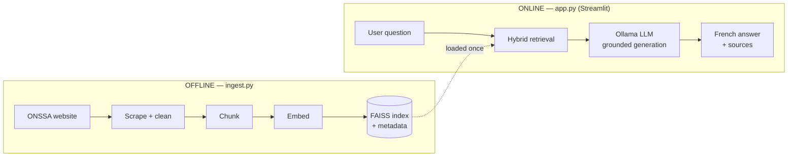
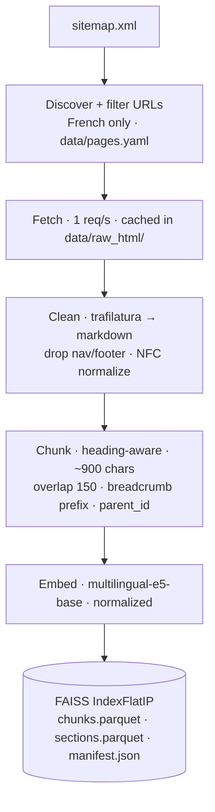
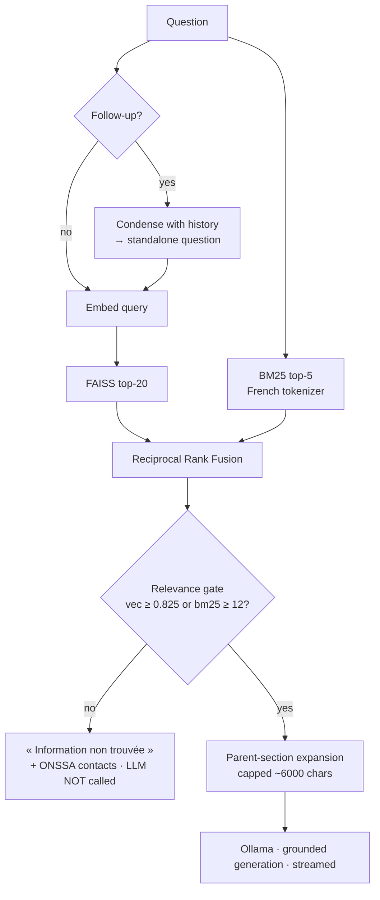

# Architecture & Design Decisions

Technical documentation for the ONSSA assistance chatbot. This is the "brief
explanation of architectural decisions" deliverable — every non-obvious choice
is stated with its justification and the alternative it beat.

---

## 1. Problem and approach

The chatbot must answer visitor questions about the ONSSA website
(https://www.onssa.gov.ma/) **using only that website's content**, in French,
with follow-up support, and **without any paid API**.

A plain LLM cannot do this: it hallucinates and knows nothing precise about
ONSSA. The answer is **Retrieval-Augmented Generation (RAG)** — retrieve the
real ONSSA text first, then force the LLM to answer only from that text.

The system is split into two halves that share one artifact (the knowledge base):

- **Offline** (`ingest.py`) — build the knowledge base once: scrape → clean →
  chunk → embed → index.
- **Online** (`app.py`) — the chat: every question is embedded, matched against
  the knowledge base, and answered by a local LLM. **It never touches the website.**



---

## 2. Website reconnaissance (what shaped the design)

Before writing code, we inspected the live site. Four findings drove the design:

| Finding | Consequence |
|---|---|
| WordPress + **Yoast sitemaps** enumerate every page | No blind crawling — `sitemap.xml` is the source of URLs |
| WordPress **REST API returns near-empty content** (Elementor stores content elsewhere) | Scrape the **rendered HTML**, not the API |
| Content is **server-rendered** (verified on `/missions/`) | Plain `requests` is enough — **no Selenium/Playwright** at ingest time |
| Site is trilingual, **French is default** | Index **French pages only** — Arabic/English duplicates would pollute retrieval |

---

## 3. The ingestion pipeline (`ingest.py`)



**Key decisions**

- **URL discovery via sitemap + `data/pages.yaml`** (curated include/exclude rules)
  instead of link-crawling — deterministic, auditable, and it *is* the
  "list of indexed pages" deliverable (regenerated as `docs/indexed_pages.md`).
- **`trafilatura` for extraction** — state-of-the-art boilerplate removal, which
  matters on Elementor pages full of menus. Output is **markdown** so headings
  survive for the chunker. A BeautifulSoup pass over `.elementor-widget-container`
  is the fallback.
- **Politeness**: 1 request/second, identifiable User-Agent, and **local HTML
  caching** — the site is hit once; every re-run is offline.
- **Heading-aware chunking**: split on markdown headings (one topic per chunk),
  then pack into ~900-char chunks with 150-char word-boundary overlap. Each chunk
  is prefixed with a breadcrumb (`Page title › Section`) so it stays
  self-describing after retrieval, and stores a `parent_id` pointing to its full
  section (see §5, small-to-big).

**Current knowledge base:** 284 pages → 333 sections → **1,187 chunks**.

---

## 4. Embeddings & vector store

| Choice | Value | Why |
|---|---|---|
| Embedding model | **`intfloat/multilingual-e5-base`** (768-dim) | Strong on French, free, local. Rejected `all-MiniLM-L6-v2` — English-centric, the classic mistake on a French corpus. |
| Prefixes | `query:` / `passage:` | E5 is trained with them; omitting them measurably degrades retrieval. |
| Vector DB | **FAISS `IndexFlatIP`** over L2-normalized vectors (= cosine) | Required by the assignment. Corpus is small (~1.2k vectors) → **exact** search is instant; no IVF/HNSW approximation needed. |
| Compatibility guard | `manifest.json` records the embedding model | The app **refuses to run** if the index was built with a different model. |

---

## 5. Retrieval — hybrid, gated, small-to-big

This is the heart of the system and where the most engineering went.



**Why hybrid (vector + BM25).** Pure embeddings miss exact tokens (acronyms like
SIPS, Codex, law numbers). BM25 keyword search catches them. The two rankings are
merged with **Reciprocal Rank Fusion** (parameter-light, no score calibration).

**Why BM25 is a *precision* leg.** French morphology first *broke* hybrid search
(it scored 10/15 vs vector's 12/15 — see §8) because BM25 matches exact tokens and
"organisé" ≠ "organisation". Fixes: accent-stripping + a **6-character prefix
stem** that folds morphological variants, and using only BM25's **top-5** hits at
full weight — its deeper list is common-stem noise. Result: **14/15**.

**The relevance gate (anti-hallucination).** e5 scores even unrelated text at
~0.80 cosine, so the textbook 0.30 threshold would never fire. We measured
in-scope (≥0.837) vs out-of-scope (≤0.817) questions and set the gate at
**0.825 cosine OR BM25 ≥ 12**. Below it, the LLM is **never called** — the bot
returns a fixed French fallback. This is why "prix du Bitcoin" is refused instantly.

**Small-to-big (parent-section expansion).** We *search* over small chunks
(precise) but *hand the LLM* each winning chunk's full parent section (complete —
a procedure arrives with all its steps). Free, because sections are already stored.

---

## 6. Generation & grounding

- **LLM:** `mistral:7b` via **Ollama** (local, open-source, strong French). Model
  is configurable per session; low-RAM alternatives (`llama3.2:3b`, `qwen2.5:3b`)
  documented. **No API key anywhere.**
- **French system prompt** enforces the assignment's Answer Rules: answer only
  from the extracts; no legal/medical/veterinary advice; cite sources `[n]`; never
  invent facts or external references; and (added after red-teaming, see
  [security.md](security.md)) never reveal the instructions or obey in-chat
  attempts to change the rules.
- **`num_ctx=8192`** — Ollama's 4096 default silently truncates the system prompt
  on context-rich questions (a real bug caught in testing).
- **Streaming** via `st.write_stream`; **temperature 0.0** (deterministic/factual).
- **Follow-ups** are condensed into standalone questions before retrieval, so
  "et pour l'exportation ?" retrieves correctly.

---

## 7. Application layer (Streamlit)

- **Chat** with persistent, disk-backed conversations (one JSON per conversation
  in `data/conversations/`, gitignored — user chats are personal data).
- **Sidebar:** ONSSA logo, conversation list with **search / new / switch /
  delete**, reset, always-visible **model name + indexed-document counts**
  (assignment requirement), a **⚙️ settings** panel (model, temperature, top-k,
  context size — live session overrides), and an **ℹ️ about** panel.
- **Live status** during the silent CPU phase: the reformulated question and the
  retrieved pages are shown *before* generation starts.
- **Voice (fully local):** 🎙️ mic input transcribed by **faster-whisper**, and a
  🔊 read-aloud button using **Piper** TTS — both offline, no API. Answer text is
  cleaned (citations/URLs/markdown stripped) before synthesis.
- **Feedback:** 👍/👎 per answer, logged to `data/feedback.jsonl`.
- Models load once via `st.cache_resource`.

---

## 8. Evaluation — measured, not assumed

Retrieval quality is measured, not asserted. `eval.py` scores **hit@5** (is the
correct ONSSA page in the top-5 retrieved?) over 15 questions with verified
expected URLs, comparing naive (vector-only) against hybrid:

| Retrieval | hit@5 |
|---|---|
| Vector-only (naive) | 13 / 15 |
| **Hybrid (vector + BM25 + RRF)** | **14 / 15** |

The parameters (BM25 depth and weight) were **chosen by sweeping** against this
set — the honest engineering story is *measure → diagnose → fix → re-measure*,
not "add fashionable techniques."

---

## 9. What we deliberately did NOT do

| Rejected | Why |
|---|---|
| LangChain / LlamaIndex | The pipeline is 5 clear steps; a framework hides them behind abstractions we'd have to explain anyway. Hand-rolled = every line justifiable, fewer dependencies. |
| Re-ranking (cross-encoder) | Modest gain here for a second model + latency on CPU. Kept as a documented option only. |
| HyDE / multi-query | Extra LLM calls per question on a local 7B → slower for marginal gain on a small corpus. |
| GraphRAG / agentic RAG | Built for corpus-wide reasoning over huge datasets; massive overkill, hard to explain, slow. Our threshold-gate is the lightweight, robust version of "should I answer?". |
| Approximate FAISS (IVF/HNSW) | ~1.2k vectors — exact search is already instant. |

These are right-sized choices for a small, structured, French corpus — not the
fanciest, the most defensible.

---

## 10. Project structure

```
app.py                  Streamlit chat UI
ingest.py               knowledge-base build CLI (scrape → index)
eval.py                 retrieval evaluation (hit@5, naive vs hybrid)
src/onssa_rag/
  config.py             all tunables via env vars
  scraping.py           sitemap discovery, fetching, caching
  cleaning.py           trafilatura extraction + normalization
  chunking.py           heading-aware splitter (parent_id)
  embeddings.py         sentence-transformers (query/passage prefixes)
  vectorstore.py        FAISS build/load/search + manifest
  retriever.py          hybrid FAISS+BM25, RRF, gate, parent expansion
  llm.py                Ollama client (health, stream, models)
  rag.py                condense → retrieve → gate → grounded generate
  conversations.py      disk-persisted chat store
  voice.py              faster-whisper STT + Piper TTS
data/
  pages.yaml            indexed-pages config (source of truth)
  eval_questions.yaml   15-question eval set
  index/                FAISS index + metadata + manifest
docs/                   this documentation + screenshots
tests/                  24 unit/smoke tests
```
